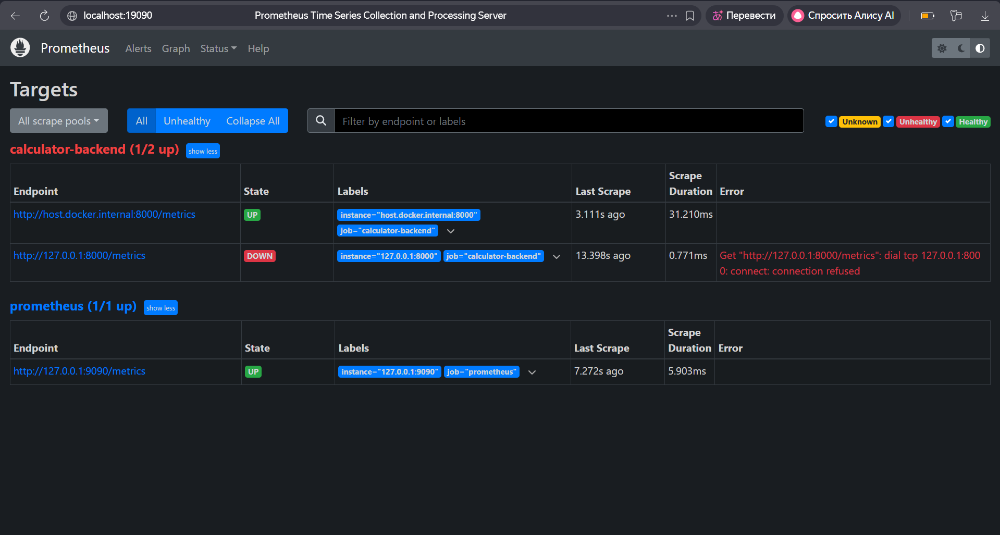
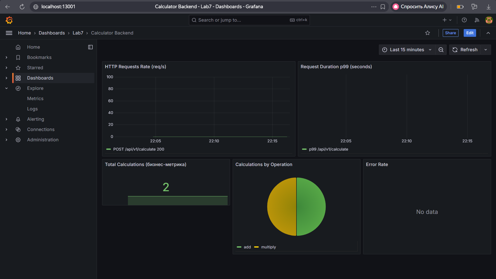
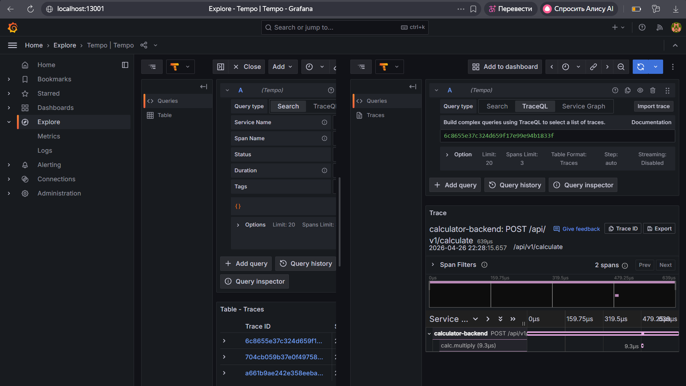

# Лабораторная работа №7: Observability (Prometheus, Grafana, Grafana Tempo)

## Цель работы

- Экспортировать метрики в формате Prometheus и настроить их скрейпинг
- Построить дашборды в Grafana с запросами PromQL
- Внедрить распределённый трейсинг (OpenTelemetry, OTLP) и принимать трейсы в Grafana Tempo
- Разделить код приложения (инструментирование) и платформенный стек наблюдаемости

---

## Структура проекта

```
lab7/
├── calculator-app/
│   ├── requirements.txt
│   └── src/
│       └── main.py                  # Flask-приложение с метриками и трейсингом
└── calculator-observability/
    ├── docker-compose.yml           # Prometheus + Grafana + Tempo
    └── compose/
        ├── prometheus/
        │   └── prometheus.yml       # Конфигурация скрейпинга
        ├── grafana/
        │   ├── dashboards/
        │   │   └── lab7-calculator.json   # Дашборд Calculator Backend
        │   └── provisioning/
        │       ├── dashboards/dashboards.yml
        │       └── datasources/datasources.yml
        └── tempo/
            └── tempo.yaml           # Конфигурация Grafana Tempo
```

---

## Реализация

### Метрики (`/metrics`)

В `src/main.py` реализованы следующие метрики Prometheus:

| Метрика | Тип | Описание |
|---------|-----|----------|
| `http_requests_total` | Counter | Количество HTTP-запросов: labels `method`, `endpoint`, `status` |
| `http_request_duration_seconds` | Histogram | Длительность HTTP-запросов: labels `method`, `endpoint` |
| `calculator_operations_total` | Counter | **Бизнес-метрика:** количество выполненных операций: label `operation` |

Эндпоинт `/metrics` реализован через `DispatcherMiddleware` из `werkzeug`:

```python
from prometheus_client import Counter, Histogram, make_wsgi_app
from werkzeug.middleware.dispatcher import DispatcherMiddleware

application = DispatcherMiddleware(app, {"/metrics": make_wsgi_app()})
```

### Трейсинг (OpenTelemetry → Tempo)

Трейсинг настроен через `opentelemetry-sdk` с экспортом по OTLP HTTP. При наличии переменной окружения `OTEL_EXPORTER_OTLP_ENDPOINT` трейсы отправляются в Grafana Tempo. Каждая операция калькулятора оборачивается в span:

```python
with tracer.start_as_current_span(f"calc.{operation}"):
    result = getattr(calc, operation)(a, b)
```

### Конфигурация скрейпинга (`prometheus.yml`)

```yaml
scrape_configs:
  - job_name: prometheus
    static_configs:
      - targets: ["127.0.0.1:9090"]

  - job_name: calculator-backend
    metrics_path: /metrics
    static_configs:
      - targets: ["host.docker.internal:8000"]
```

> `host.docker.internal` — DNS-имя, которое Docker Desktop резолвит в IP хост-машины. Это позволяет Prometheus внутри контейнера обращаться к Flask-приложению, запущенному напрямую на хосте.

---

## Запуск (инструкция воспроизведения)

### Требования

- Docker Desktop (Windows/Mac) или Docker + Docker Compose v2 (Linux)
- Python 3.10+

### Шаг 1 — Запустить стек наблюдаемости

```bash
cd lab7/calculator-observability
docker compose up -d
```

Сервисы и порты:

| Сервис | URL | Логин / пароль |
|--------|-----|----------------|
| Prometheus | http://localhost:19090 | — |
| Grafana | http://localhost:13001 | admin / admin |
| Tempo HTTP | http://localhost:13200 | — |
| OTLP HTTP | http://localhost:14318 | — |

### Шаг 2 — Запустить calculator-app на хосте

```bash
cd lab7/calculator-app
pip install -r requirements.txt
```

**Windows (PowerShell):**
```powershell
$env:OTEL_EXPORTER_OTLP_ENDPOINT="http://localhost:14318"
$env:OTEL_SERVICE_NAME="calculator-backend"
$env:PORT="8000"
python -m src.main
```

**Linux / macOS:**
```bash
OTEL_EXPORTER_OTLP_ENDPOINT=http://localhost:14318 \
  OTEL_SERVICE_NAME=calculator-backend \
  python -m src.main
```

После запуска приложение доступно на `http://localhost:8000`.

### Шаг 3 — Проверить Prometheus Targets

Открыть `http://localhost:19090/targets` и убедиться что job `calculator-backend` в статусе **UP**.

### Шаг 4 — Сгенерировать нагрузку

**Windows (PowerShell):**
```powershell
curl -Method POST http://localhost:8000/api/v1/calculate `
  -ContentType "application/json" `
  -Body '{"operation": "add", "a": 10, "b": 5}'

curl -Method POST http://localhost:8000/api/v1/calculate `
  -ContentType "application/json" `
  -Body '{"operation": "multiply", "a": 3, "b": 7}'
```

**Linux / macOS:**
```bash
curl -X POST http://localhost:8000/api/v1/calculate \
  -H "Content-Type: application/json" \
  -d '{"operation": "add", "a": 10, "b": 5}'
```

### Шаг 5 — Открыть дашборд в Grafana

`http://localhost:13001` → Dashboards → Lab7 → **Calculator Backend**

### Остановка

```bash
docker compose -f lab7/calculator-observability/docker-compose.yml down
```

---

## Скриншоты

### 1. Prometheus Targets — job calculator-backend UP

---

### 2. Grafana — дашборд Calculator Backend



Дашборд содержит панели:
- **HTTP Requests Rate** — rate запросов по endpoint и статусу
- **Request Duration p99** — 99-й перцентиль времени ответа
- **Total Calculations (бизнес-метрика)** — счётчик операций
- **Calculations by Operation** — распределение по типу операции (add, multiply, ...)
- **Error Rate** — доля запросов с ошибкам
---

### 3. Grafana Explore — трейс в Tempo


---

## PromQL — примеры запросов из дашборда

```promql
# Rate HTTP-запросов за последние 5 минут
rate(http_requests_total[5m])

# 99-й перцентиль длительности запросов
histogram_quantile(0.99, rate(http_request_duration_seconds_bucket[5m]))

# Суммарное количество операций калькулятора
sum(calculator_operations_total) by (operation)

# Доля ошибочных запросов (4xx + 5xx)
sum(rate(http_requests_total{status=~"4..|5.."}[5m])) /
sum(rate(http_requests_total[5m]))
```